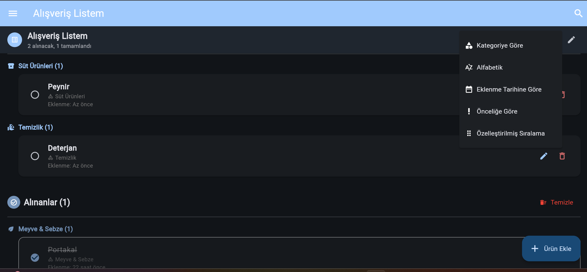

# 🛒 Alışveriş Listesi Uygulaması

Modern ve kullanıcı dostu bir alışveriş listesi uygulaması. Flutter ile geliştirilmiş, yerel veritabanı kullanarak alışveriş listenizi istediğiniz yerde yönetmenize olanak tanır.



## 🌐 Web Versiyonu
Web versiyonuna [https://barisgrbz.github.io/shopping_list_app/](https://barisgrbz.github.io/shopping_list_app/) adresinden erişebilirsiniz.

## ✨ Özellikler

- ✅ Alışveriş öğeleri ekleme, düzenleme ve silme
- 📋 Çoklu ürün ekleme - alt alta yazılan ürünleri otomatik olarak ayrı ayrı ekleme
- 🔄 Öğeleri satın alındı olarak işaretleme
- 🕒 Eklenme zamanı bilgisi ve "ne zaman eklendi" gösterimi
- 👆 Öğeleri kaydırarak (swipe to dismiss) silme özelliği
- 🔍 Yaygın kullanılan ürünleri hızlıca eklemek için öneriler
- 🧹 Tamamlanan öğeleri toplu olarak temizleme
- 🌓 Açık ve koyu tema desteği
- 💾 Hive veritabanı ile yerel depolama
- 📱 Android, iOS ve Web platformları desteği

## 🛠️ Teknolojiler

- **Flutter**: UI geliştirme
- **Provider**: State yönetimi
- **Hive**: Yerel veritabanı
- **Intl**: Tarih formatları
- **Google Fonts**: Modern yazı tipleri
- **UUID**: Benzersiz kimlik oluşturma

## 📂 Proje Yapısı

```
lib/
├── models/         # Veri modelleri
├── providers/      # State yönetimi
├── screens/        # Uygulama ekranları
├── utils/          # Yardımcı işlevler ve araçlar
│   ├── app_logger.dart      # Uygulama kayıt sistemi
│   ├── color_utils.dart     # Renk işleme yardımcıları
│   ├── icon_utils.dart      # İkon işleme yardımcıları
│   ├── category_helper.dart # Kategori yardımcıları
│   └── constants.dart       # Sabitler
├── widgets/        # Yeniden kullanılabilir bileşenler
│   ├── add_list_dialog.dart    # Liste ekleme diyaloğu
│   ├── base_list_dialog.dart   # Diyalog taban sınıfı
│   ├── edit_list_dialog.dart   # Liste düzenleme diyaloğu
│   ├── shopping_list_item.dart # Alışveriş listesi öğesi widget'ı
│   └── add_item_dialog.dart    # Ürün ekleme diyaloğu
└── main.dart       # Uygulama girişi
```

## 🚀 Kurulum

### Ön Koşullar

- Flutter SDK (3.x veya üzeri)
- Dart SDK (3.7.0 veya üzeri)
- Android Studio / VS Code (önerilen)
- Android SDK / Xcode (mobil platformlar için)

### Adımlar

1. Depoyu klonlayın:
   ```bash
   git clone https://github.com/barisgrbz/shopping_list_app.git
   cd shopping_list_app
   ```

2. Bağımlılıkları yükleyin:
   ```bash
   flutter pub get
   ```

3. Hive adaptörlerini oluşturun:
   ```bash
   flutter pub run build_runner build
   ```

4. Uygulamayı çalıştırın:
   ```bash
   flutter run
   ```

## 📱 Derleme

### Android APK oluşturmak için:

```bash
flutter build apk
```

### Web sürümü derlemek için:

```bash
flutter build web --base-href /shopping_list_app/
```

### iOS için:

```bash
flutter build ios
```

## 💡 Kullanım

- Ana ekranda "+" butonuna tıklayarak yeni ürünler ekleyin
- Çoklu ürün eklemek için her satıra bir ürün yazın ve "Ekle" butonuna tıklayın
- Ürünün yanındaki onay kutusuna tıklayarak satın alındı olarak işaretleyin
- Ürünü sağa kaydırarak veya sil butonuna basarak listeden kaldırın
- "Temizle" butonuna tıklayarak tüm satın alınmış ürünleri tek seferde silin
- Yaygın ürünleri ekleme diyaloğundaki çiplerden seçerek hızlıca ekleyin

## 🔮 Gelecek Özellikler

- [x] Çoklu liste desteği
- [x] Kategorilere göre filtreleme
- [x] Çoklu ürün ekleme
- [ ] Bulut senkronizasyonu
- [ ] Liste paylaşma
- [ ] Bildirimler ve hatırlatıcılar
- [ ] Sesli komutlarla ürün ekleme

## Güncellemeler (Changelog)
Güncellemeleri görmek için [Changelog.md](CHANGELOG.md) dosyasına göz atabilirsiniz.

## 🤝 Katkıda Bulunma

Katkılarınızı bekliyoruz! Projeye katkıda bulunmak için:

1. Bu depoyu forklayın
2. Kendi branch'inizi oluşturun (`git checkout -b feature/amazing-feature`)
3. Değişikliklerinizi commit edin (`git commit -m 'Add some amazing feature'`)
4. Branch'inize push edin (`git push origin feature/amazing-feature`)
5. Pull Request oluşturun

## 📄 Lisans

Bu proje MIT lisansı altında lisanslanmıştır - detaylar için [LICENSE](LICENSE) dosyasına bakın.

---

⭐ Bu projeyi beğendiyseniz, yıldız vermeyi unutmayın! ⭐